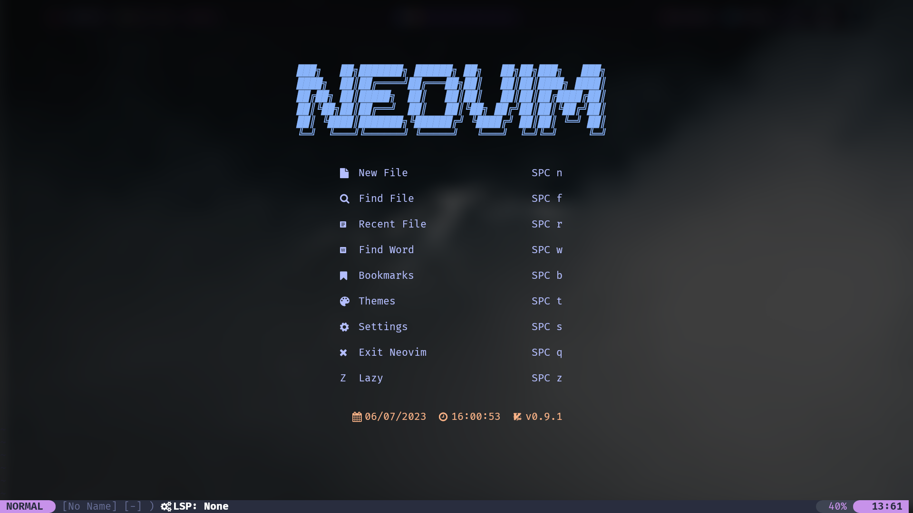
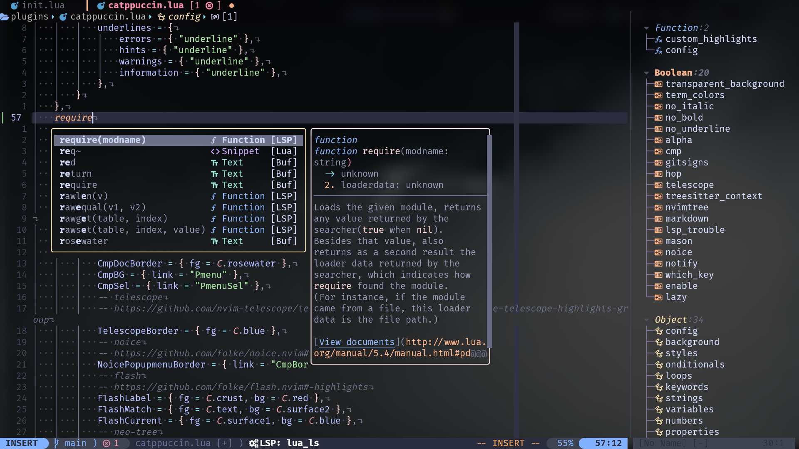

> [!WARNING]
> This configuration has been deprecated. See [nvimrc-astro](https://github.com/LAST7/nvimrc-astro) instead.

# My Neovim Configuration

## Colorscheme

- [catppuccin-mocha](https://github.com/catppuccin/nvim)
  
  

_screenshots are outdated_

## List of plugins (managed by Lazy)

- [Comment](https://github.com/numToStr/Comment.nvim)
- [LuaSnip](https://github.com/L3MON4D3/LuaSnip)
- [alpha](https://github.com/goolord/alpha-nvim)
- [bufferline](https://github.com/akinsho/bufferline.nvim)
- [colorizer](https://github.com/norcalli/nvim-colorizer.lua)
- [nvim-cmp](https://github.com/hrsh7th/nvim-cmp)
- [nvim-cmp-fonts](https://github.com/amarakon/nvim-cmp-fonts)
- [cmp-buffer](https://github.com/hrsh7th/cmp-buffer)
- [cmp-calc](https://github.com/hrsh7th/cmp-calc)
- [cmp-nvim-lsp](https://github.com/hrsh7th/cmp-nvim-lsp)
- [cmp-path](https://github.com/hrsh7th/cmp-path)
- [cmp_luasnip](https://github.com/saadparwaiz1/cmp_luasnip)
- [flash](https://github.com/folke/flash.nvim)
- [friendly-snippets](https://github.com/rafamadriz/friendly-snippets)
- [gitsigns](https://github.com/lewis6991/gitsigns.nvim)
- [indent-blankline](https://github.com/lukas-reineke/indent-blankline.nvim)
- [lazygit](https://github.com/kdheepak/lazygit.nvim)
- [lspkind](https://github.com/onsails/lspkind.nvim)
- [lspsaga](https://github.com/glepnir/lspsaga.nvim)
- [lualine](https://github.com/nvim-lualine/lualine.nvim)
- [markdown-preview](https://github.com/iamcco/markdown-preview.nvim)
- [mason-lspconfig](https://github.com/williamboman/mason-lspconfig.nvim)
- [mason-null-ls](https://github.com/williamboman/mason-lspconfig.nvim)
- [mason](https://github.com/williamboman/mason.nvim)
- [mini.align](https://github.com/echasnovski/mini.align)
- [neo-tree](https://github.com/nvim-neo-tree/neo-tree.nvim)
- [neo-dev](https://github.com/folke/neodev.nvim)
- [noice](https://github.com/folke/noice.nvim)
- [nui](https://github.com/MunifTanjim/nui.nvim)
- [notify](https://github.com/rcarriga/nvim-notify)
- [null-ls](https://github.com/jose-elias-alvarez/null-ls.nvim)
- [autopairs](https://github.com/windwp/nvim-autopairs)
- [jdtls](https://github.com/mfussenegger/nvim-jdtls)
- [nvim-lspconfig](https://github.com/neovim/nvim-lspconfig)
- [nvim-treesitter](https://github.com/nvim-treesitter/nvim-treesitter)
- [nvim-treesitter-textobjects](https://github.com/nvim-treesitter/nvim-treesitter-textobjects)
- [nvim-ts-autotag](https://github.com/windwp/nvim-ts-autotag)
- [nvim-web-devicons](https://github.com/nvim-tree/nvim-web-devicons)
- [plenary](https://github.com/nvim-lua/plenary.nvim)
- [tabout](https://github.com/abecodes/tabout.nvim)
- [telescope](https://github.com/nvim-telescope/telescope.nvim)
- [todo-comments](https://github.com/folke/todo-comments.nvim)
- [toggleterm](https://github.com/akinsho/toggleterm.nvim)
- [trouble](https://github.com/folke/trouble.nvim)
- [surround](https://github.com/kylechui/nvim-surround)
- [ReplaceWithRegister](https://github.com/inkarkat/vim-ReplaceWithRegister)
- [which-key](https://github.com/folke/which-key.nvim)
